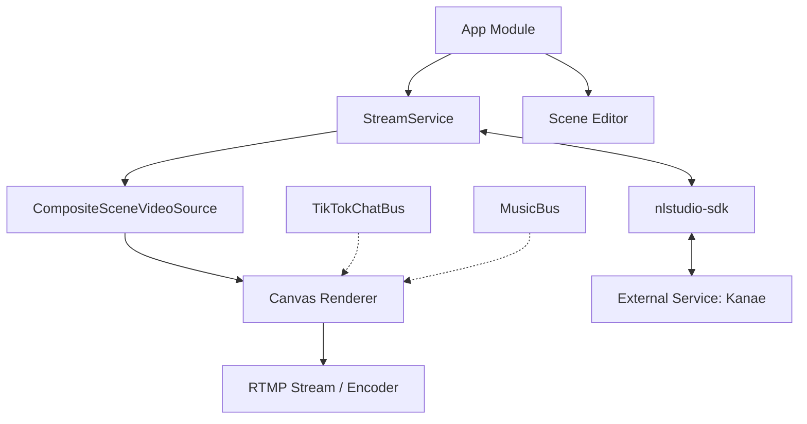

# NL Studio (Nae Live Studio) 🎥✨

**NL Studio** adalah platform *mobile broadcasting* yang dirancang khusus untuk kreator konten di Android. Aplikasi ini menghadirkan pengalaman layaknya **OBS (Open Broadcaster Software)** ke dalam genggaman tangan, memungkinkan pengguna untuk melakukan live streaming profesional ke platform seperti TikTok dengan fitur kustomisasi scene yang mendalam.

---

## 🚀 Fitur Utama

*   **OBS-style Scene Management**: Kelola berbagai *scene* dengan sistem *layer* (lapisan) yang fleksibel.
*   **Multi-Source Overlay**: Dukungan layer untuk Capture Layar, Gambar, Video, Teks, hingga Animasi Suara.
*   **Integrasi TikTok Real-time**: Menampilkan pesan chat, gift, dan notifikasi interaksi (follow/like/share) TikTok secara langsung di atas stream.
*   **Professional Audio Mixer**: Kontrol volume Mikofon dan Audio Sistem secara terpisah untuk hasil suara yang seimbang.
*   **Smooth Transitions**: Efek *cross-fade* antar scene untuk transisi yang elegan dan profesional.
*   **High-Performance Encoding**: Mendukung hardware & software encoding dengan optimasi khusus untuk Android 14+.
*   **Music Integration (Kanae Service)**: Integrasi dengan layanan musik untuk menampilkan informasi lagu dan kontrol pemutaran.
*   **Local Test Recording**: Fitur rekam lokal untuk menguji kualitas encoder sebelum melakukan live streaming.

---

## 🏗️ Arsitektur Proyek

NL Studio dibangun dengan arsitektur modular yang memisahkan logika inti streaming dengan antarmuka integrasi pihak ketiga.

### 📐 Diagram Blok Arsitektur



### 🧩 Komponen Utama

1.  **StreamService (Foreground Service)**:
    Jantung dari aplikasi yang menjaga proses streaming tetap berjalan di latar belakang. Mengelola `MediaProjection`, `RtmpStream`, dan siklus hidup encoder.
    
2.  **CompositeSceneVideoSource**:
    Engine rendering kustom yang menggabungkan berbagai sumber video/gambar ke dalam satu frame menggunakan `Canvas`. Engine ini menangani penempatan layer, z-index, dan transparansi.

3.  **NL Studio SDK (nlstudio-sdk)**:
    Modul yang menyediakan antarmuka **AIDL (Android Interface Definition Language)**. Ini memungkinkan NL Studio berkomunikasi dengan proses lain (seperti "Kanae Service") untuk mendapatkan data TikTok dan kontrol musik secara *inter-process*.

4.  **VideoCacheManager**:
    Sistem manajemen cache yang melakukan *pre-warming* pada aset video untuk memastikan transisi background scene yang instan tanpa *lag*.

---

## 📂 Struktur Folder

```text
NLStudio/
├── app/                     # Modul aplikasi utama (UI & Logika Bisnis)
│   ├── src/main/java/.../OBS/       # Engine Streaming & Scene Rendering
│   └── src/main/java/.../scene/     # Manajemen Repository & Model Scene
├── nlstudio-sdk/            # SDK untuk integrasi pihak ketiga
│   └── src/main/aidl/       # Definisi interface komunikasi (IKanaeService)
└── build.gradle             # Konfigurasi build proyek
```

---

## 🛠️ Tech Stack

*   **Language**: Kotlin & Java
*   **Streaming Engine**: RootEncoder (RTMP/RTSP/SRT)
*   **UI Framework**: Android Jetpack (AppCompat, Material Design)
*   **IPC**: AIDL for Inter-Process Communication
*   **Concurrency**: Kotlin Coroutines & SingleThreadExecutor for smooth rendering
*   **Graphics**: Canvas API & GLStreamInterface
*   **Compatibility**: Optimized for Android 10+ (API 29) up to Android 14+ (API 34)

---

## 🎨 Prinsip Desain

*   **Smoothness First**: Semua tugas berat (decoding, JSON parsing, file I/O) dipindahkan ke background thread untuk menjaga UI tetap responsif 60 FPS.
*   **Modularitas**: Pemisahan SDK memudahkan pengembangan fitur baru atau integrasi dengan layanan streaming lainnya di masa depan.
*   **Resource Efficiency**: Penggunaan `VirtualDisplay` global dan sistem cache cerdas untuk meminimalkan beban CPU dan konsumsi baterai.

---

<p align="center">
  Dibuat dengan ❤️ untuk komunitas streamer Indonesia.
</p>
