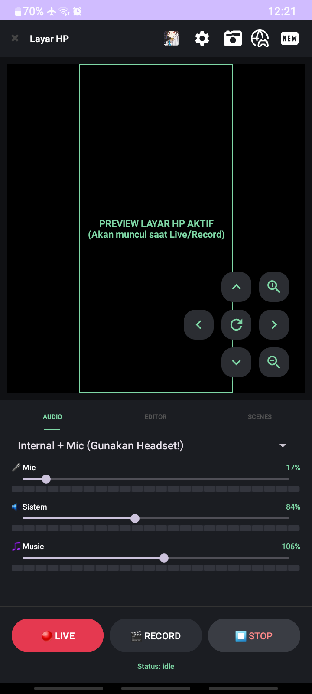
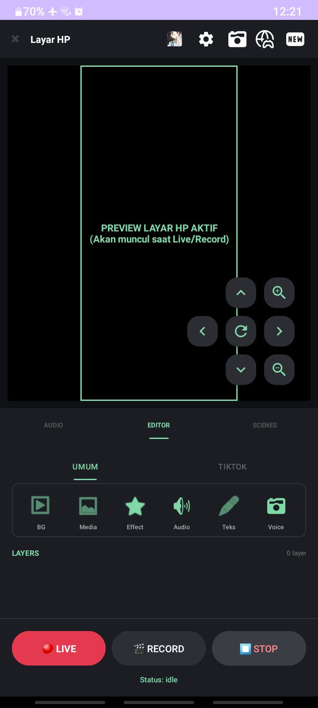
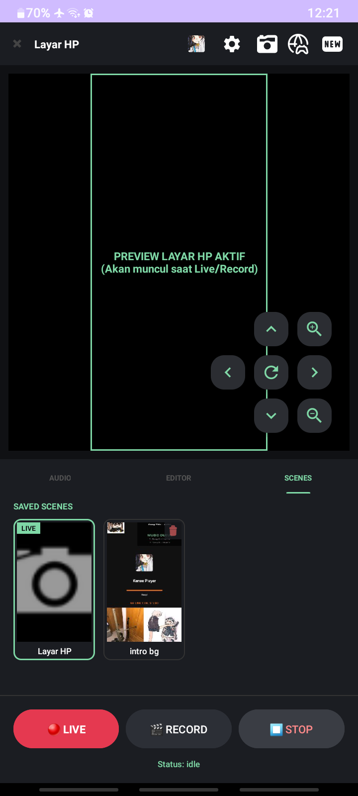
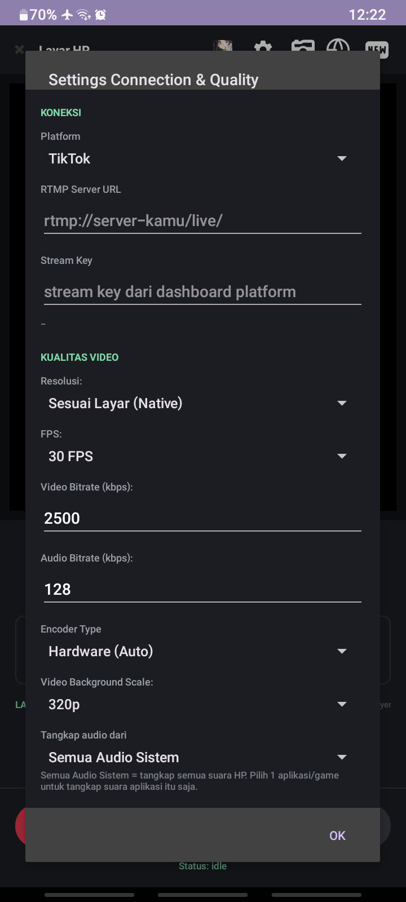
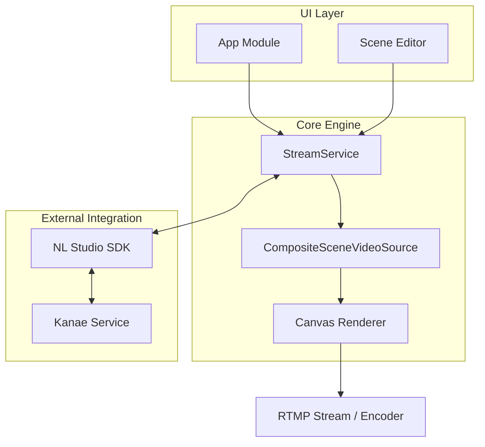

# NL Studio (Nae Live Studio) 🎥✨

  
  
  
  

**NL Studio** adalah platform *mobile broadcasting* yang dirancang khusus untuk kreator konten di Android. Aplikasi ini menghadirkan pengalaman layaknya **OBS (Open Broadcaster Software)** ke dalam genggaman tangan, memungkinkan pengguna melakukan live streaming profesional ke berbagai platform seperti TikTok dengan fitur kustomisasi scene yang mendalam.

---

## 🖼️ Tampilan Aplikasi

| Home Screen | Scene Editor | Live Stream | Settings |
| :---: | :---: | :---: | :---: |
|  |  |  |  |

---

## 🚀 Fitur Utama

*   **🎨 OBS-style Scene Management**: Kelola berbagai *scene* dengan sistem *layer* (lapisan) yang fleksibel.
*   **🧩 Multi-Source Overlay**: Dukungan layer untuk Capture Layar, Gambar, Video, Teks, hingga Animasi Suara.
*   **📱 Integrasi TikTok Real-time**: Menampilkan pesan chat, gift, dan notifikasi interaksi (follow/like/share) secara langsung.
*   **🔊 Professional Audio Mixer**: Kontrol volume Mikrofon dan Audio Sistem secara terpisah.
*   **✨ Smooth Transitions**: Efek *cross-fade* antar scene untuk transisi yang elegan.
*   **⚡ High-Performance Encoding**: Optimasi khusus untuk Android 14+ (API 34).
*   **🎵 Music Integration (Kanae Service)**: Kontrol musik dan info lagu secara *real-time*.
*   **📹 Local Test Recording**: Rekam lokal untuk menguji kualitas sebelum *go live*.

---

## 🏗️ Arsitektur Proyek

NL Studio menggunakan arsitektur modular untuk memastikan performa tinggi dan skalabilitas.

### 📐 Diagram Alur

### 🧩 Komponen Utama

1.  **StreamService**: Jantung aplikasi (Foreground Service) yang mengelola `MediaProjection` dan siklus hidup streaming.
2.  **CompositeSceneVideoSource**: Engine rendering kustom yang menggabungkan berbagai layer menggunakan `Canvas`.
3.  **NL Studio SDK**: Antarmuka **AIDL** untuk komunikasi *inter-process* dengan layanan pihak ketiga.
4.  **VideoCacheManager**: Sistem manajemen cache untuk memastikan aset video termuat secara instan.

---

## 🛠️ Tech Stack

- **Languages**: Kotlin (Utama) & Java
- **Streaming**: [RootEncoder](https://github.com/pedroSG94/RootEncoder) (RTMP, RTSP, SRT)
- **Graphics**: Canvas API & GLStreamInterface
- **IPC**: AIDL for Inter-Process Communication
- **Architecture**: MVVM + Modular

---

## ☕ Dukungan & Donasi

Jika proyek ini membantu Anda, pertimbangkan untuk mendukung pengembang melalui:

*   **Saweria**: [https://saweria.co/shinriMe](https://saweria.co/shinriMe)

---

  Dibuat dengan ❤️ oleh <b>Shinri</b>

