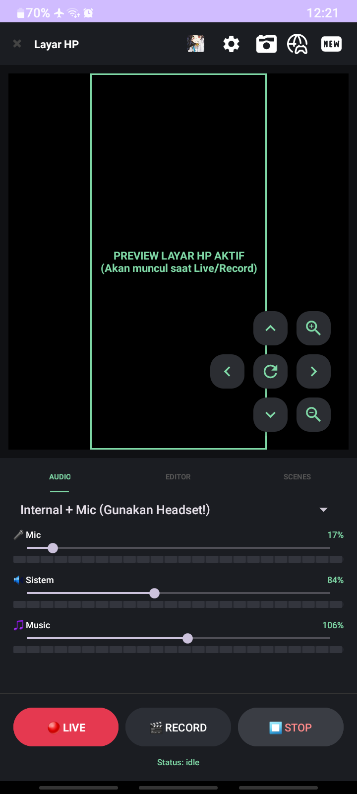
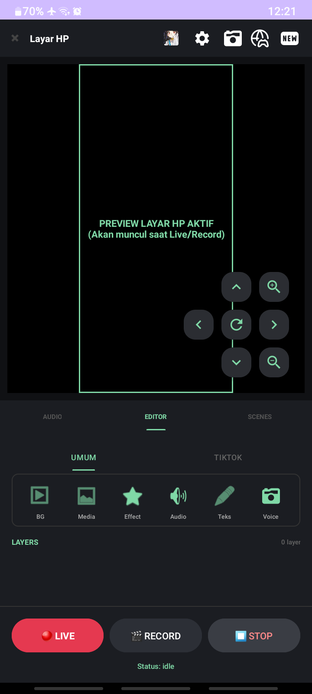
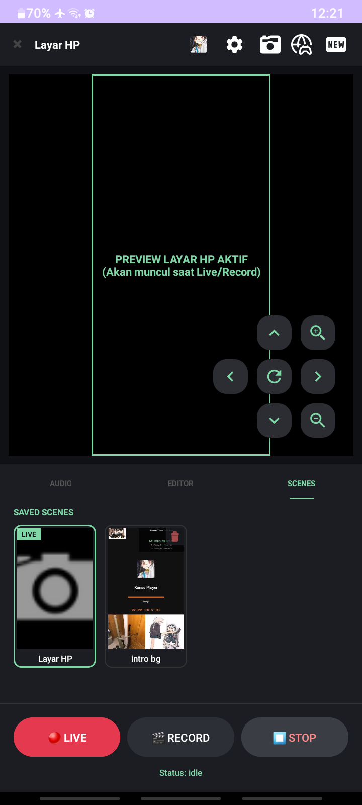
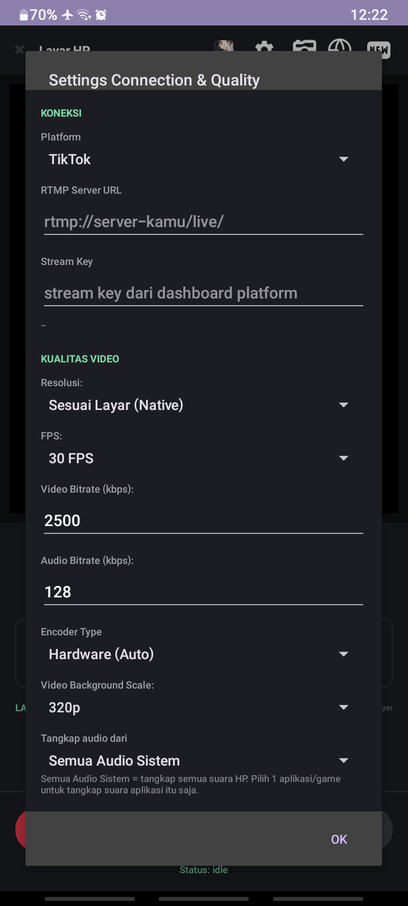
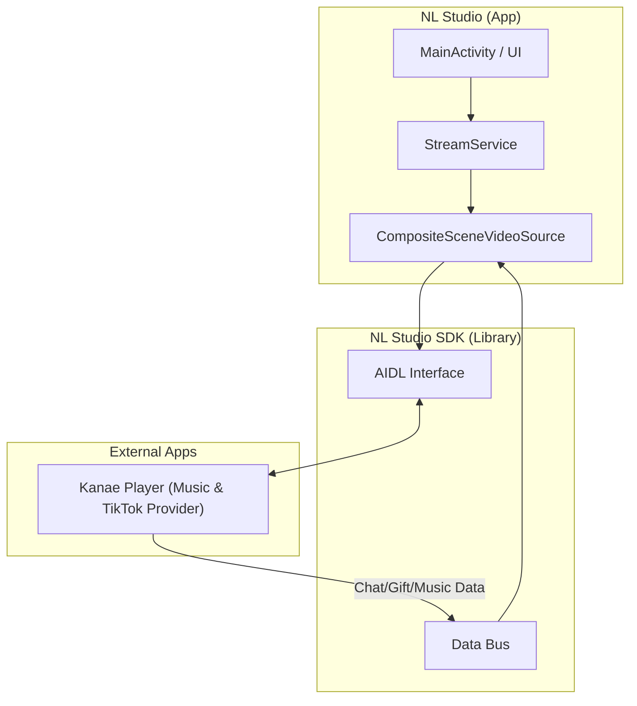

# NL Studio (Nae Live Studio) 🎥✨

  
  
  
  

**NL Studio** adalah platform *mobile broadcasting* yang dirancang khusus untuk kreator konten di Android. Aplikasi ini menghadirkan pengalaman layaknya **OBS (Open Broadcaster Software)** ke dalam genggaman tangan, memungkinkan pengguna melakukan live streaming profesional ke berbagai platform dengan kustomisasi scene yang mendalam.

---

## 🖼️ Tampilan Aplikasi

| Home Screen | Scene Editor | Live Stream | Settings |
| :---: | :---: | :---: | :---: |
|  |  |  |  |

---

## 🚀 Fitur Utama

*   **🎨 OBS-style Scene Management**: Kelola berbagai *scene* dengan sistem *layer* (lapisan) yang fleksibel.
*   **🧩 Multi-Source Overlay**: Dukungan layer untuk Capture Layar, Gambar, Video, Teks, hingga Animasi Suara.
*   **📱 Integrasi TikTok Real-time**: Menampilkan pesan chat, gift, dan notifikasi interaksi (follow/like/share) secara langsung.
*   **🔊 Professional Audio Mixer**: Kontrol volume Mikrofon dan Audio Sistem secara terpisah (Butuh Android 10+).
*   **✨ Smooth Transitions**: Efek *cross-fade* antar scene untuk transisi yang elegan.
*   **⚡ High-Performance Encoding**: Optimasi khusus untuk encoder Hardware dan Software.
*   **📹 Local Test Recording**: Rekam lokal untuk menguji kualitas sebelum *go live*.

---

## 🔗 Integrasi Aplikasi Wajib

Untuk menggunakan fitur **TikTok Live Overlay** (Chat, Gift, Join) dan **Music Player** (Music Current/Queue), Anda **WAJIB** menginstal aplikasi pendamping berikut:

### 🎵 [Kanae Player](https://github.com/ShinriShoaku/KanaePlayer)
**Kanae Player** berfungsi sebagai penyedia data (Data Provider) yang akan mengirimkan informasi chat TikTok dan metadata musik ke NL Studio melalui **NL Studio SDK**. Tanpa aplikasi ini, layer TikTok dan Music di NL Studio tidak akan menampilkan data apapun.

---

## 🏗️ Arsitektur Proyek

NL Studio menggunakan arsitektur modular yang terhubung dengan ekosistem luar melalui SDK khusus.

### 📐 Diagram Arsitektur

```mermaid
graph TD
    subgraph "NL Studio (App)"
        A[MainActivity / UI]
        B[StreamService]
        C[CompositeSceneVideoSource]
    end

    subgraph "NL Studio SDK (Library)"
        D[AIDL Interface]
        E[Data Bus]
    end

    subgraph "External Apps"
        F["Kanae Player (Music & TikTok Provider)"]
    end

    A --> B
    B --> C
    C --> D
    D <--> F
    F -- "Chat/Gift/Music Data" --> E
    E --> C
```

### 🧩 Komponen Utama

1.  **StreamService**: Foreground Service yang mengelola MediaProjection dan siklus hidup streaming.
2.  **CompositeSceneVideoSource**: Engine rendering yang menggabungkan berbagai layer menggunakan Canvas/OpenGL.
3.  **nlstudio-sdk**: Modul library yang menangani komunikasi IPC (Inter-Process Communication) menggunakan **AIDL**.
4.  **VideoOptimizer**: Melakukan optimalisasi resolusi dan bitrate video background agar ringan saat di-decode hardware.

---

## 🛠️ Tech Stack

- **Min API**: 24 (Android 7.0)
- **Target API**: 36 (Android 15)
- **Core Library**: [RootEncoder](https://github.com/pedroSG94/RootEncoder)
- **UI Framework**: Android XML / Material Components
- **Media**: Media3 / ExoPlayer untuk video background

---

## ☕ Dukungan & Donasi

Jika proyek ini membantu Anda, pertimbangkan untuk mendukung pengembang melalui:

*   **Saweria**: [https://saweria.co/shinriMe](https://saweria.co/shinriMe)

---

  Dibuat dengan ❤️ oleh <b>Shinri</b>

